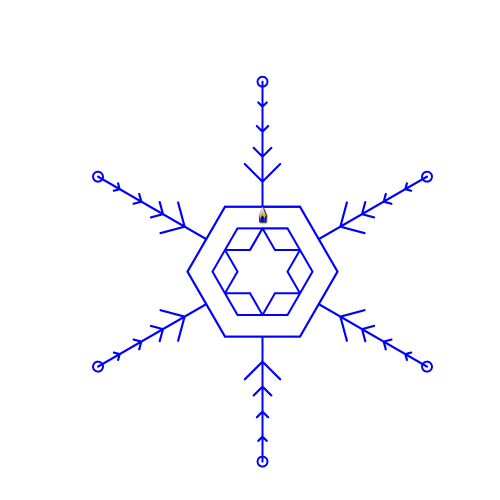

# 不同班级区别

## 1.驯兽师课程
- 年龄/年级：二年级～三年级

### 传感器应用，在玩中学，用科学的方式体会世界。

> - 动手能力
> - 软件使用
> - 科学入门
> - 综合能力培养

1. 趣味性强：

> 通过具有趣味性、适合低龄小学生的创客项目的学习，以mbot为载体，使小学生在具体情境中理解和学习各种传感器的原理，并会使用这些传感器通过编写程序实现自己的创意。

2. 多元融合：

> 在项目的选择和设计过程中，融入了艺术、科学、绘画、数学、音乐、手工、机械组装等知识和元素，这样不仅增加了项目的趣味性和创意性，让小学生在做中学，玩中学，提供学生试错的机会，增强学生的灵活性。通过这些项目的学习增强了学生对科学技术的热爱，锻炼了学生的动手能力，培养了学生的逻辑思维能力和科学素养，扩展了学生的知识面。

3. 互动教学：

> 通过提问、动画吸引学生的注意力;讲练结合，缩短讲解时间，增加动手时间;保证全部同学学完基础知识，完成基本任务。对掌握较快的同学提供扩展任务，对掌握较慢的同学一对一讲解和辅导。


## 2.蛟龙X班

### 年龄/年级：四年级～五年级

用电脑的 __画笔__ “教”电脑画画

*初步* 了解编程语言
> 前进 fd  后退 bk 左转lt 右转rt 画圆 c,o
#### 举例

```cpp
p.speed(500).size(3);
p.c(1).o(100);
```
> 简单的通过命令来画画，怎么向前，怎么向后，怎么转弯，怎么画圆，让孩子理解人机交互的方式。并初步入门计算机语言。


```cpp
double pi = 3.14;
p.speed(100).size(5);
for (int i = 0;i< 120; i++){
	p.fd(pi*50/18).rt(3);
}
```
> 教孩子怎么结构一个图形，怎么通过，计算机语言中最重要的部分之一 *循环*(loop)，理解如何通过循环来构建普通的图形。

**简单** 的函数封装定义
> 把一个一直做的事情放在一起，不用每次都写
#### 举例


> 每一个边一样，可以看成是六个相同部分的组合。
所以我们可以把这个看成是一个相同部分的六次组合，只要找到这个部分，让他作为一个整体。

```cpp
int main()
{
    for(int i=1;i<=1;i++)
    {
        for(int j=1;i<=4;j++)
        {
            p.fd(50);
            p.lt(45);
            p.fd(50/j);
            p.bk(50/j);
            p.rt(90);
            p.fd(50/j);
            p.bk(50/j);
            p.lt(45);
        }
        p.fd(50).o(10).bk(250);
    }
}
```


> 将这部分重复六遍，就大大减少了代码的量，这就是封装函数的意义。

#### 蛟龙X班的课程目的是：
- 进一步增强孩子的理性思维能力
> 相对于驯兽师课程来说，蛟龙X班的课程更加接近于真实的编程环境，很多的逻辑，如函数封装、递归等思想，都是后期真正编程的基础。蛟龙X班的课程是真正意义上的编程（孩子自己动手写代码）。
- 增强孩子数形结合思想
> 数与形是数学中的两个最古老，也是最基本的研究对象，它们在一定条件下可以相互转化。中学数学研究的对象可分为数和形两大部分，数与形是有联系的，这个联系称之为数形结合，或形数结合。
- 蛟龙1-3班的预科班
> 编程思想不是与生俱来的，甚至到本科的教学中，都有大量学生无法理解编程思想。编程是抽象的，是需要在大脑想象的。蛟龙X班的课程是将编程中简单的部分拿出来，与图形结合，让孩子可以更加具体的理解这其中的思想，为后期抽象的蛟龙班打下基础，方便后期的理解。

## 蛟龙1-3班
### 年龄/年级：
> 五年级～九年级
### 学习的内容
 * 1班：
> - 程序结构
> - 程序组成
> - 程序组成
> - 定义变量
> - 赋值语句
> - cin与cout
> - 编程环境
> - 分支结构
> - 选择结构
> - 循环结构


 * 2班：

> - 认识数组
> - 一维数组的综合应用
> - 数组的初始化（未初始化时数据杂乱）
> - 字符数组
> - 字符串的综合案例
> - 进制转换
> - 一些经典算法的学习

* 3班:
> - 二维数组
> - 结构体
> - 递归思想
> - 文件操作
> - 指针与动态数组
> - 高精度计算


### 学习的目标
- 能力：
> 解决问题、理解分析、逻辑思维、（自）学习、专注力、细心与耐心等
- 成绩：
> 语文成绩、数学成绩、英语成绩、综合成绩，高考必考流程图
- 升学：
> 特长生政策、初高中招生简历/面试、高考强基计划/综合评价
- 技能：
> 学到算法阶段水平超过绝大多数计算机专业本科生
- 未来：
> 未来人工智能……时代，学会编程更好的融入新时代

### C++是什么
> - C++是一种复杂的编程语言/工具，应用在很多领域。中小学阶段很多专业竞赛需要使用这门语言。
> - 可以应用在大部分领域，如：服务器端开发、游戏设计、软件设计、操作系统等等，许多软件的部分功能都是C++实现的。

### 参加信息学竞赛

- 信息学竞赛是什么？
> 全国青少年信息学奥林匹克竞赛，教育局和科协委托中国计算机学会主办，是青少年阶段最高水平的编程竞赛，也是五大学科竞赛之一。选拔与培养优秀的计算机人才，许多选手已成为硕士、博士，走进科研领域。

- 信息学竞赛又什么用（升学）？
> - 信息学竞赛分省赛与国赛，不同阶段获奖的证书有不同的作业。
> - 省赛获奖证书对小升初、初升高的简历筛选增加极大的含金量，部分顶尖中学有特长生政策。
> - 省赛中的提高组获奖，可参加省内双一流大学、南科、北外、港中深等校综合评价降分录取。
> - 国赛金牌每年50人，直接保送清华、北大；银铜牌参加清北等985学校强基计划降分录取。
- 信息学竞赛难吗？
> - 信息学竞赛难度高于文化课的。在过去是顶尖高中选拔出来搞的，也是培养优秀的计算机人才的，肯定难。但学生既然有能力学习，肯定要去尝试，如果有潜力可以帮助升学，即使不走竞赛，也对学生各方面能力也有很大的提升。