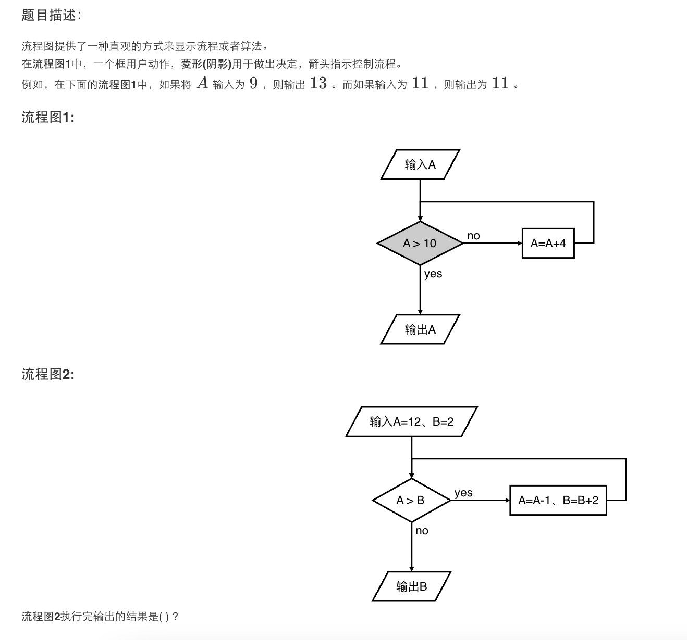

# 测试题

## 题目

1. 如果被减数增加1.5，减数减少1.5，那么差就(_增加三_)
2. 一本书有450页，小明每天看29页看了8天，小明一共看了几页？还剩几页？(232、218)
3. 1999999+199999+19999+1999+199+19 = 2222214
4. 今年前5个月，小明每月平均存钱4元，从6月起他每月存6元。那么从哪个月起小明的平均储蓄超过5元？(11)
5. 7年前，妈妈的年龄是儿子的六倍，儿子今年12岁，妈妈今年几岁？(37)
6. 493至少增加（2 ）才是3的倍数，至少减少（3 ）才是5的倍数。
7. 公鸡5文钱一只，母鸡3文钱一只，小鸡3只一文钱，用100文钱买一百只鸡 , 其中公鸡，母鸡，小鸡都必须要有，问公鸡，母鸡，小鸡要买多少只刚好凑足100文钱。 12 4 84
8. 2个苹果或2串葡萄重量和4个香蕉重量相等，问一个苹果加一串葡萄等于几个香蕉的重量。
9. 用1、2、3、4、5、6可以组成多少个没有重复数字的个位是5的三位数? A55 20
10. 

11. 两根同样长的绳子，第一根剪去它的一半，第二根剪去0.5米，剩下的两段绳子（ ） (不一定哪根长)

12. 锯10米长的木棒,每锯一段要2分钟.把这根木棒锯成相等的5段,一共要(8)分钟。

13. 小明有10本书,小红有6本书,小明给小红 (2) 本书后,两人的书一样多。
14. 两个连续的偶数和是162，这两个数中较小的数是(80 ),较大的数是(82 )。
15. 有88只猴子要选大王，选举办法如下：
所有猴子按1∼8编号围坐一圈，从第1号开始按顺序1 2 3 ⋯ 8报数，凡报到3的猴子退出到圈外，如此循环报数，直到圈内只剩下一只猴子时，这只猴子就是大王。请你写出大王的编号。 7
16. 一个猴子吃桃子，吃了一半后还不够又多吃了2个桃子。按这样的规律一直吃着，到了第5天一看只有6个了（还没有开始吃）！请你写出最开始有多少个桃子。156
17. 有一个具有规律的数列前几项如下1、1、2、3、5、8、3…… ，那么数列的第88项和第99项之和是（ ）。 55
18. 下面的算式中，实、验、舱代表三个不同的数字，其中实是一个偶数，实=()，验= ()，舱 =() 。

        实验舱
          验舱
        +   舱
        ------
        9 9 5
19. Mas喜欢小宠物，他拥有的宠物满足以下条件：

    除去三只，剩下都是狗
    除去三只，剩下都是猫
    除去四只，剩下都是鼠
    那么，Mas到底养了多少只宠物？ 5

20. 在一个果园里，Mas已经将所有的果子打了下来，而且按果子的不同种类分成了不同的堆，现在Mas想要将所有的果子合并成一堆。
合并规则如下:

    每一次合并，Mas可以把两堆果子合并到一起，消耗的体力等于两堆果子的重量之和。

    因为还要花大力气把这些果子搬回家，所以Mas在合并果子时要尽可能地节省体力。

    如果有两堆果子重量分别是1,2，合并成一堆需要消耗的最小体力是3

    现在有 6堆果子,总量分别为：

    7 10 15 2 11 5
    请你写出最小的体力耗费值
    (121)
21. 甲、乙、丙、丁四个人过桥，分别需要1分钟，2分钟，5分钟，10分钟。因为天黑，必须借助手电筒过桥。可是他们总共只有一个手电筒，并且桥的载重能力有限，最多只能承受两个人的重量，也就是说，每次最多过两个人，现在希望可以用最短的时间过桥，最少耗时为 (17) 分钟。
22. 如下所示的数字三角形，从顶部出发，在每一结点可以选择移动至其左下方的结点或移动至其右下方的结点，一直走到底层，要求找出一条路径，使路径上的数字的和最大。
下面数字三角形最大路径和为(30)

                  7
                3   8
              8   1   0
            2   7   4   4
          4   5   2   6   5
23. 有44个数字1、2、3、44。
它们可以有很多种排列方式,我们给这些排列编号，以下是编号编号为1∼10的排列

        1 : 1234
        2 : 1243
        3 : 1324
        4 : 1342
        5 : 1423
        6 : 1432
        7 : 2134
        8 : 2143
        9 : 2314
        10 : 2341
    编号为1的排列是1234，编号为2的排列是1243。
    请你写出编号为16的排列。
    3241

24. 农夫知道一头牛的位置，想要抓住它。农夫和牛都位于数轴，如果农夫当前位置为XX。农夫有两种移动方式：

        1. 从XX移动到X-1或X+1，每次移动花费一分钟
        2. 从XX移动到2×X，每次移动花费一分钟

    现在农夫起始位于点5,牛位于点17，假设牛没有意识到农夫的行动，站在原地不动。农夫最少要花多少时间才能抓住牛？5